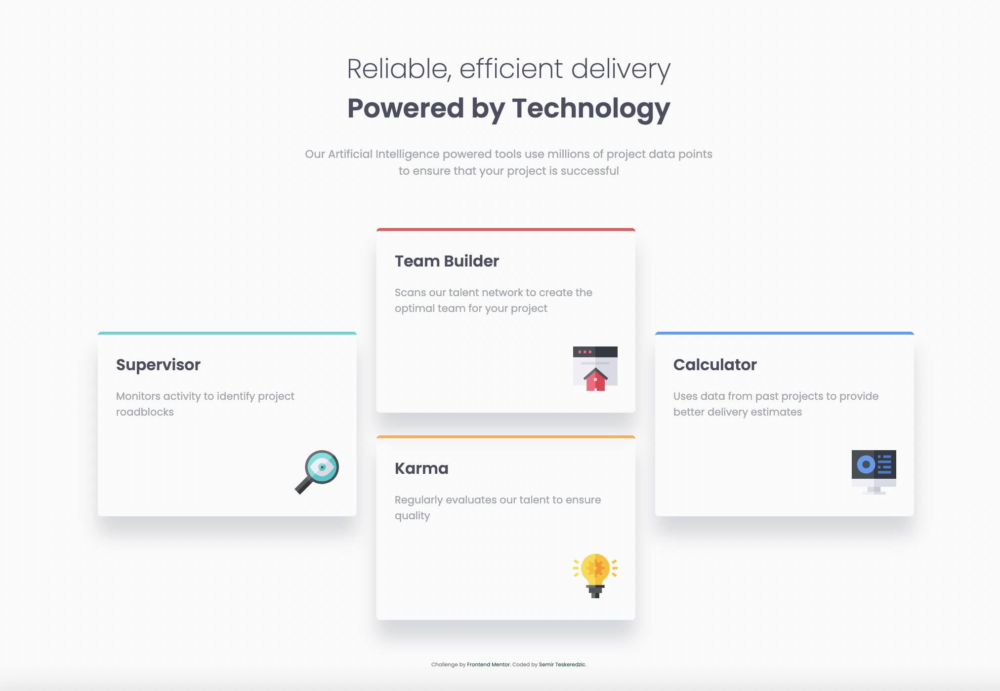
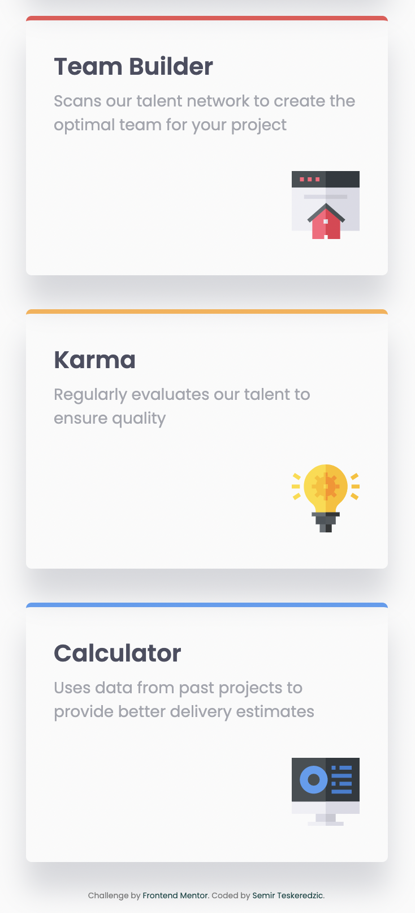

# Frontend Mentor - Four card feature section solution

This is a solution to the [Four card feature section challenge on Frontend Mentor](https://www.frontendmentor.io/challenges/four-card-feature-section-weK1eFYK). Frontend Mentor challenges help you improve your coding skills by building realistic projects. 

## Table of contents

- [Overview](#overview)
  - [The challenge](#the-challenge)
  - [Screenshot](#screenshot)
  - [Links](#links)
- [My process](#my-process)
  - [Built with](#built-with)
- [Author](#author)

## Overview

### The challenge

Users should be able to:

- View the optimal layout for the site depending on their device's screen size

### Screenshot

### Links

- Solution URL: [Solution URL](https://www.frontendmentor.io/solutions/four-card-feature-section-with-html-and-css-8VbXMfvdV)
- Live Site URL: [Live Site URL](https://semirteskeredzic.github.io/four-card-section/)

## My process

Before starting to code I've created an empty git repository and initialized a git repository inside my project folder, then I set the git remote to the newly created repository.
After that I reviewed design and wrote down HTML structure of elements along with the class names using double and single dash notation. I've created a new preparation branch and went on implementing HTML structure along with global imports of fonts and stylesheets. I've pushed the code and merged it to main branch. 

I went from mobile view and populated all HTML elements and added icon elements. Then I styled mobile view. This part was pretty straight forward as the most amount of work went to applying correct box shadow.

On desktop view there was intricate grid system but that was also solved pretty easy with template columns and rows and assigning values for each element to start/stop. Column gap also had to be used.

### Built with

- Semantic HTML5 markup
- CSS custom properties
- Grid system
- Mobile-first workflow

## Author

- Github - [Semir Teskeredzic](https://github.com/semirteskeredzic)
- Frontend Mentor - [@semirteskeredzic](https://www.frontendmentor.io/profile/semirteskeredzic)
- Twitter - [@dofedome](https://www.twitter.com/dofedome)